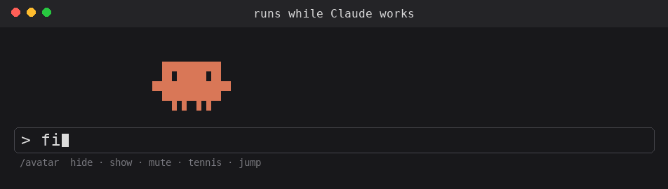

# markmerk-mods

A small [Claude Code](https://claude.com/claude-code) plugin marketplace. It holds one mod for now:
**runner-avatar**.

## runner-avatar

A small Claude avatar lives in the band above your prompt and reacts to what Claude is doing.



### What it does

| When | The avatar |
| --- | --- |
| Nothing is happening | strolls slowly back and forth, plays a short game of tennis after about 20 seconds, then falls asleep (`zZz`) |
| You send a prompt | stops and looks up (`!`) |
| Claude is working | runs, and its bubble shows the current tool: the start of a Bash command, the file being read or edited, `searching`, `browsing`, … plus how full the context window is |
| A tool call fails or is blocked | flinches (`oops` / `blocked`) |
| A subagent is working | a small avatar runs beside it (up to three) |
| The turn ends | does a little dance (`done ✓ 12s`), or shows `stopped` / `error` |
| The turn took 15 s or longer | plays a short chime, so you can look away while Claude works |
| Context is 85 % full or more | turns red |
| You click it | hops |

In the desktop app it is drawn as a vector image instead of block characters.

### Commands

| Command | Does |
| --- | --- |
| `/avatar` | hide or show the avatar |
| `/avatar hide` · `/avatar show` | the same, explicitly |
| `/avatar mute` · `/avatar unmute` | turn the end-of-turn chime off or on |
| `/avatar tennis` | start or stop a game of tennis (needs a terminal at least ~48 columns wide) |
| `/avatar jump` | make it hop |

Hide and mute are remembered between sessions.

## Install

```sh
claude plugin marketplace add MarkMerk/markmerk-mods
claude plugin install runner-avatar@markmerk-mods
```

Then start a new Claude Code session. To update later:

```sh
claude plugin marketplace update markmerk-mods
```

To remove it: `claude plugin uninstall runner-avatar@markmerk-mods`.

## Privacy

The mod makes no network calls and reads or writes no files. It doesn't run processes or call
models. It uses only:

- the tool calls Claude makes, to label the bubble on **your own screen** (shortened to 28 characters;
  keep that in mind when screen sharing);
- the session's context usage, for the percent and the red color;
- Claude Code's local plugin store, for two on/off settings (`isHidden`, `isMuted`).

Nothing is sent anywhere. The full source is in [`plugins/runner-avatar/hooks/`](plugins/runner-avatar/hooks/).

## Layout

```
.claude-plugin/marketplace.json     the catalog Claude Code reads
assets/runner-avatar.gif            the demo above
plugins/runner-avatar/
├── .claude-plugin/plugin.json      name, version, description
├── README.md                       short readme for the plugin itself
├── hooks/hooks.json                points at register.js
├── hooks/register.js               moods, tennis, /avatar, chime
├── hooks/sprite.js                 draws the avatar and catches clicks
├── sounds/done.aiff                the end-of-turn chime
└── tests/runner-avatar.test.ts     run with: claude plugin test plugins/runner-avatar
```

## License

MIT, see [LICENSE](LICENSE).
